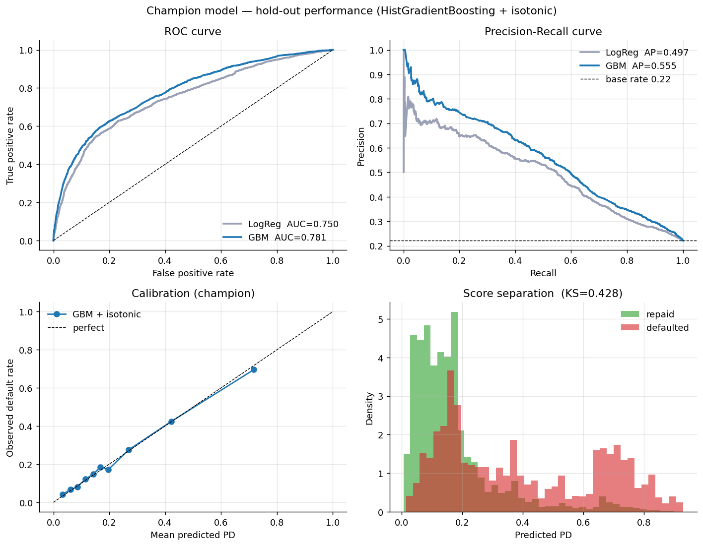
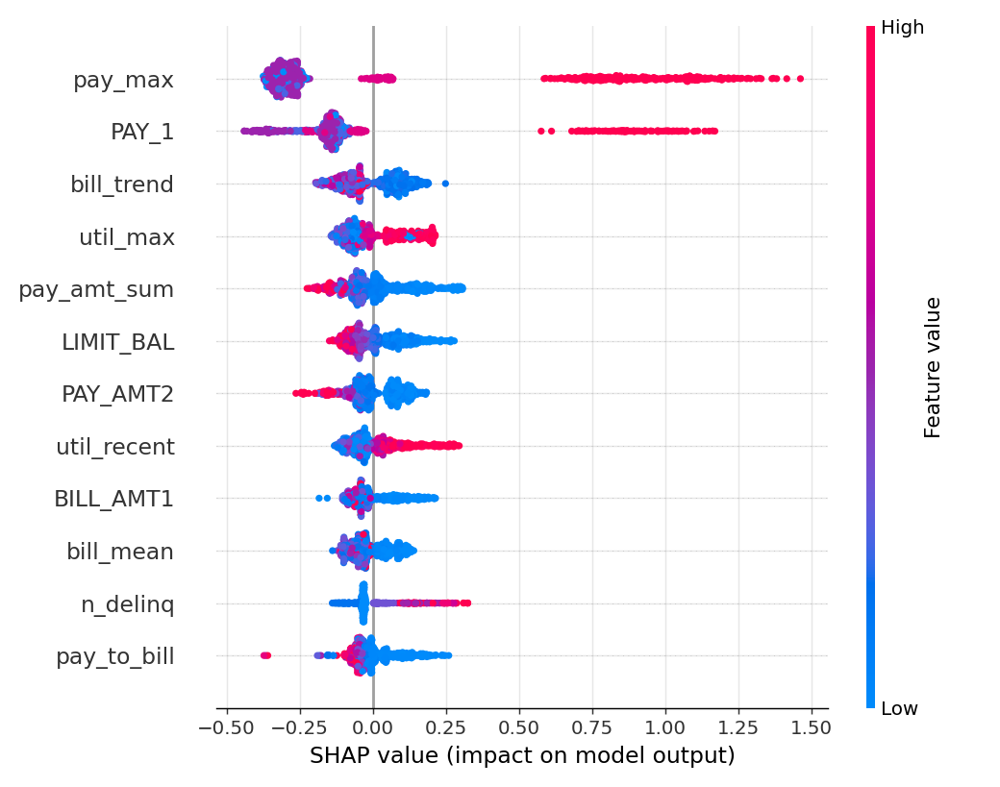

# Credit Default Prediction — a validated, governed PD model

A probability-of-default (PD) model on the UCI credit-card dataset, built end to end the way a
credit-risk function needs before a model ships: leakage-safe features, cross-validated tuning,
calibrated probabilities, and explicit validation, fairness, explainability, and failure-mode checks.

> Data: **UCI "Default of Credit Card Clients"** (Taiwan, 2005; 30,000 accounts). Public — nothing proprietary.

## Data
30,000 accounts, 23 raw features: credit limit, demographics, and six months of repayment status,
bill amounts, and payments. Target is default in the following month (22.1% base rate). Undocumented
`EDUCATION`/`MARRIAGE` codes are folded into "other" as a logged data-quality step.

## Approach
- **Features** — 23 → 36 leakage-safe features (utilization, delinquency streaks, payment-to-bill
  ratios, balance/delinquency trends). Every feature is a per-row transform of pre-decision history:
  no cross-row statistics, no target, no future information.
- **Models** — a logistic-regression scorecard baseline and a HistGradientBoosting challenger, with
  probabilities isotonic-calibrated.
- **Validation** — a 30% hold-out is split off once and never used for fitting, tuning, or calibration.
  Hyperparameters are tuned by 5-fold CV on the training set only, and CV AUC plus the train–test gap
  are reported so overfitting is measured rather than assumed away.

## Results (30% hold-out)

| Model | AUC | Gini | KS | Brier | PSI |
|---|--:|--:|--:|--:|--:|
| Logistic regression (baseline) | 0.754 | 0.509 | 0.397 | 0.192 | 0.001 |
| **HistGradientBoosting + isotonic** | **0.784** | **0.569** | **0.429** | **0.134** | **0.001** |

5-fold CV AUC on train is 0.787, in line with the 0.784 hold-out (train–test gap 0.031, PSI ≈ 0), so
the lift is validated rather than overfit. On this well-studied dataset an AUC far above ~0.80 usually
points to leakage, so a credible 0.78 was the target, not a higher vanity number.



## Explainability

Global importance from logistic coefficients, permutation importance, and SHAP. The dominant driver is
the most recent repayment status (`PAY_1`). Per-applicant SHAP values feed the adverse-action layer.



## Where it breaks (`outputs/findings.md`)
- Calibration is weakest in the high-risk tail, exactly where declines happen — route those to human
  review rather than auto-decline.
- Discrimination is uneven across segments, so a single global cutoff is not equally fair or accurate.
- A set of confidently-approved accounts (PD < 10%) still default: the silent false negatives that
  pure auto-approval would miss.

## Fairness & governance
Discrimination and decline rates are computed across sex, age band, and education (`outputs/fairness.csv`);
parity is reasonable on sex and age but weak on education, which is flagged as a fairness risk.
[`MODEL_CARD.md`](MODEL_CARD.md) covers intended use, limitations, monitoring (PSI and calibration drift),
human checkpoints, and alignment to **OSFI E-23** and **FCAC**. The LLM adverse-action layer may cite only
the model's actual top risk drivers for a given applicant — it cannot introduce factors the model did not use.

## Roadmap / next steps

These are the steps that would take this work sample from a point-in-time demo toward a model an origination team could actually deploy and defend.

**Validation & monitoring**
- Run a true out-of-time / vintage split instead of the random stratified hold-out: train on earlier origination months, test on later ones to expose temporal drift. Pair it with a feature-staleness ablation on `PAY_1` and `pay_max` (the two freshest, most dominant drivers) to bound refresh cadence. This is the single largest gap and should come first.
- Replace the monitoring prose with an executable drift monitor: persist a versioned training reference (score bins, per-feature bins, calibration curve) and score each new batch for feature PSI, score PSI, and a calibration-drift test (Spiegelhalter Z / ECE), emitting warn/fail at the documented thresholds. Current PSI is train-vs-test from a single split and is near zero by construction.
- Gate champion–challenger promotion in CI (minimum AUC lift, maximum overfit gap, maximum ECE, minimum fairness parity) and serialize the fitted pipeline, data checksum, pinned package versions, and seed to a run manifest, so any model swap is auditable and reproducible.

**Modeling**
- Fix the high-risk tail: benchmark isotonic against a monotone beta / Platt recalibration on a dedicated calibration split, bootstrap the calibration map for per-decile confidence bands, and map PD to a rating master scale. Isotonic is high-variance where the top decile thins out (0.718 predicted vs 0.700 observed).
- Add monotonic constraints (HistGBM `monotonic_cst`) forcing PD to rise with the delinquency and utilization features (`PAY_1`, `pay_max`, `n_delinq`, `util_*`). This steadies tail behavior and keeps SHAP-based adverse-action reasons internally consistent, at near-zero AUC cost.
- Replace the blanket `fillna(0.0)` with missingness indicators and the GBM's native NaN handling. Filling with zero conflates "no history" with "current and zero utilization," biasing PD downward and likely feeding the confident false negatives.

**Fairness & governance**
- Report calibration per protected group (slope, intercept, ECE), not just per-segment AUC, and replace the single min/max decline-parity ratio with a reference-group adverse-impact ratio plus equalized-odds / equal-opportunity metrics, each with bootstrap CIs and a 4/5ths gate. This shows whether the weak education parity is real signal or small-sample noise (n=120).
- Ground the adverse-action reason codes in the deployed calibrated champion (they currently explain a separately refit uncalibrated GBM), and add a faithfulness test that the printed top-k reasons match the top-k SHAP drivers and that identical inputs yield identical notices.
- Add pre-registered fairness pass/fail gates, a subgroup fairness-drift monitor, and a named-owner sign-off to the governance pack. Route thin or low-AUC segments to human review using a PD uncertainty band (conformal / Venn-Abers interval width), not only a point-PD cutoff.

**Data & policy**
- Add reject inference before any origination use: the model is fit only on booked accounts, so it is biased relative to the through-the-door population it would actually score.
- Tie the cutoff to economics: optimize approve/decline bands on expected loss (PD × LGD × EAD, with `LIMIT_BAL` as an EAD proxy) and a good/default cost matrix, with segment-level bad-rate targets and a swap-set analysis, instead of the fixed 70th-percentile cutoff.
- Add a thin-file data-sufficiency flag that routes sparse applicants to a conservative policy, and reserve a documented slot for bureau-style attributes (tradeline count, inquiries, oldest-account age). The model rests on six months of `PAY_*`/`BILL_*` history, so a dormant applicant is scored low-risk by default.

## Run
```bash
pip install -r requirements.txt
python3 src/download_data.py      # fetch the public UCI dataset into data/
python3 src/pipeline.py           # build, validate, fairness, explainability, failure modes
python3 src/ai_reason_codes.py    # adverse-action notices (set ANTHROPIC_API_KEY to use the LLM)
```

## Structure
```
src/pipeline.py         model build, validation, fairness, explainability, failure-mode analysis
src/features.py         shared leakage-safe feature engineering
src/ai_reason_codes.py  LLM adverse-action layer, grounded in the model's real SHAP drivers
outputs/                metrics.json, fairness.csv, findings.md, plots
MODEL_CARD.md           intended use, performance, limitations, monitoring, governance
```
